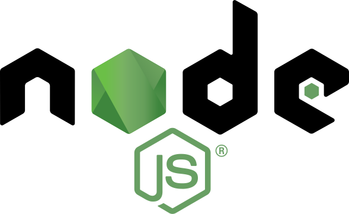

# Jackson's Pet Store

A pet store app that allows for public viewing of pets available and sold, as well as authentication for customer buying and admin marking sold and polling for sold pets.

[](https://opensource.org/licenses/Apache-2.0)


## Prerequisites

<a href="https://nodejs.org/en/"></a>

* Node 14.x
* Yarn 1.x

## Technologies


## Installation

* Clone the repo

```bash
yarn install
```

## Usage
  
```bash
yarn start
```

- Runs the app in the development mode.\
Open [http://localhost:3000](http://localhost:3000) to view it in the browser.

- The page will reload if you make edits.\
You will also see any lint errors in the console.

## Running Tests

```bash
yarn test
```

## Deployment

[Azure via DevOps](https://pet-store-hca.azurewebsites.net)

## Authors

[Jon Jackson](http://github.com/ocskier)

## License

[License](LICENSE)
## Learn More

You can learn more in the [Create React App documentation](https://facebook.github.io/create-react-app/docs/getting-started).

To learn React, check out the [React documentation](https://reactjs.org/).
